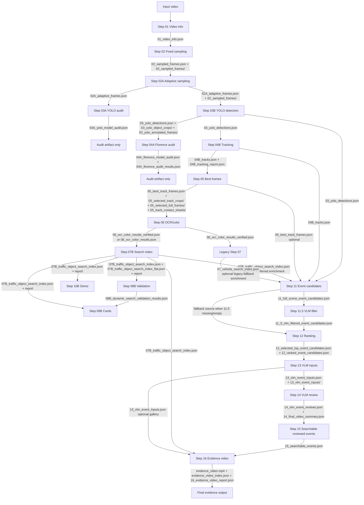
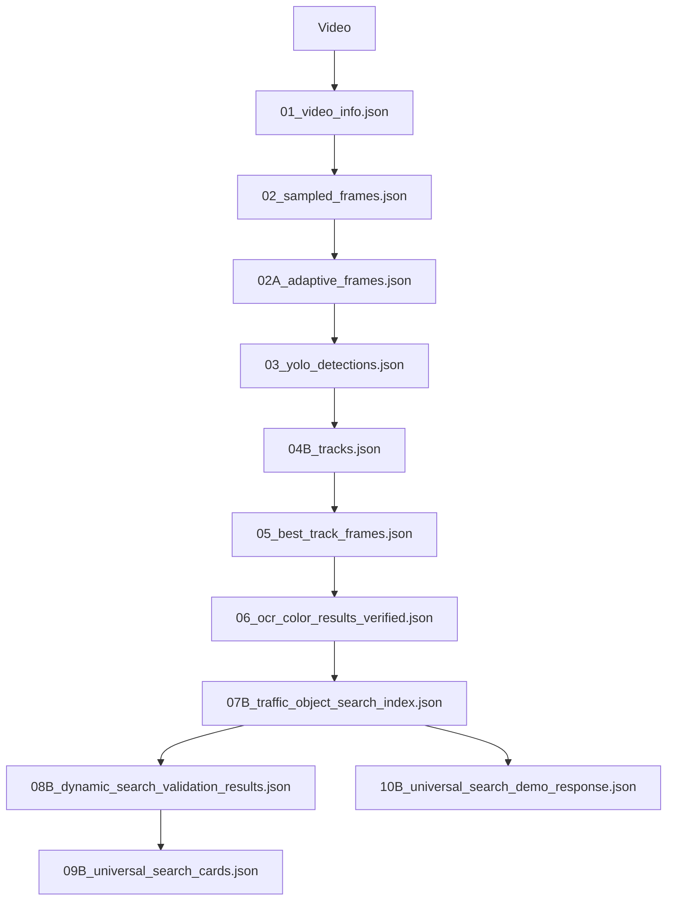
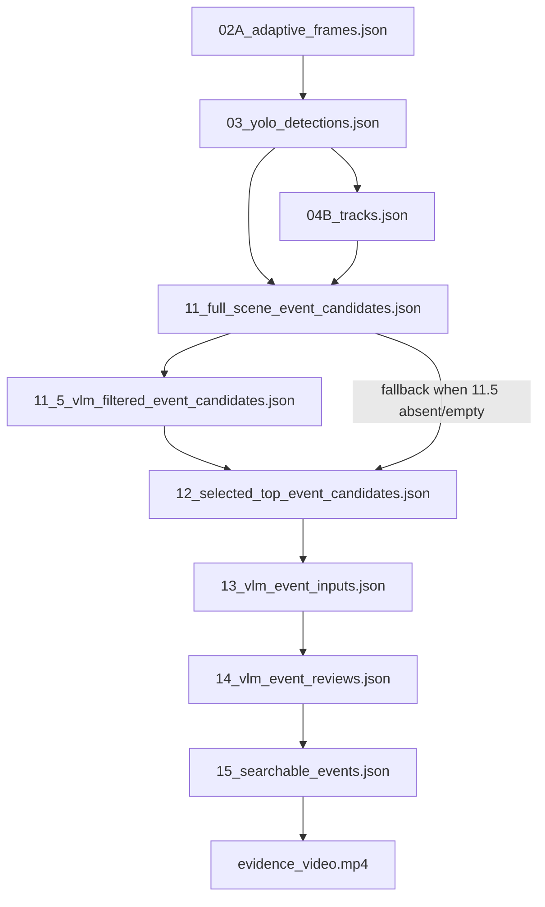
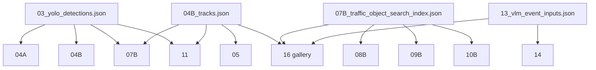

# TD Case 2 Architecture Map

## Scope

This audit covers the isolated pipeline under `tests/td_case2` and only the directly imported dependencies that the active runners call.

- `CONFIRMED`: derived directly from active source code.
- `OPTIONAL`: stage or file is used only when present or enabled.
- `LEGACY`: older branch still present in repo but not used by the active orchestrators.
- `MISMATCH`: producer and consumer filenames or schemas do not line up cleanly.
- `UNKNOWN`: not provable from current source alone.

## Entry Points

`CONFIRMED`

- Search-ready orchestrator: `tests/td_case2/run_td_case2_search_ready_pipeline.py`
  Source: `tests/td_case2/run_td_case2_search_ready_pipeline.py:10-19, 78-172`
- VLM/event orchestrator: `tests/td_case2/run_td_case2_vlm_event_pipeline.py`
  Source: `tests/td_case2/run_td_case2_vlm_event_pipeline.py:18-24, 64-139`
- Integrated UI: `tests/td_case2/td_case2_workbench_ui.py`
  Source: `tests/td_case2/td_case2_workbench_ui.py:815-873`
- Per-step rerunners: `run_td_case2_step03_yolo.py` through `run_td_case2_step16_evidence_video.py`
  Source: each runner's `read_config()` checks `TD_CASE2_RUN_DIR`

## Active Execution Order

`CONFIRMED`

Search-ready branch:

1. Step 01 `video_info`
2. Step 02 `base_frame_sampling`
3. Step 02A `motion_adaptive_sampling`
4. Step 03A `yolo_model_audit`
5. Step 03B `yolo_detection`
6. Step 04A `florence_model_audit`
7. Step 04B `tracking`
8. Step 05 `best_track_frame_selection`
9. Step 06 `ocr_color_enrichment`
10. Step 07B `traffic_object_search_index`
11. Step 08B `dynamic_search_validation`
12. Step 09B `universal_search_cards`
13. Step 10B `universal_search_demo`

VLM/event branch:

1. Step 11 `full_scene_event_candidates`
2. Step 11.5 `lightweight_vlm_filter`
3. Step 12 `event_candidate_ranking`
4. Step 13 `vlm_input_generation`
5. Step 14 `vlm_event_review`
6. Step 15 `searchable_event_generation`
7. Step 16 `evidence_video_generation`

Primary sources:

- `tests/td_case2/run_td_case2_search_ready_pipeline.py:10-19, 97-172`
- `tests/td_case2/run_td_case2_vlm_event_pipeline.py:18-24, 89-139`

## Active Vs Legacy

`CONFIRMED`

- Active search branch is `07B -> 08B -> 09B -> 10B`.
- Legacy branch is `07 -> 08 -> 09 -> 10`.
- The active search-ready orchestrator imports only `07B/08B/09B/10B`, not legacy `07/08/09/10`.
  Source: `tests/td_case2/run_td_case2_search_ready_pipeline.py:15-19`

`LEGACY`

- `run_td_case2_step07_search_index.py`
- `run_td_case2_step08_query_validation.py`
- `run_td_case2_step09_result_packaging.py`
- `run_td_case2_step10_search_demo.py`
- `step_07_search_index_enrichment.py`
- `step_08_query_search_validation.py`
- `step_09_search_result_packaging.py`
- `step_10_search_demo_runner.py`

## Important Checks

1. `CONFIRMED` Step 04B uses a custom deterministic tracker, not ByteTrack.
   Evidence: active runner calls `step_04b_tracking.run_tracking`, and the tracker logic is implemented with local `TrackState`, IoU, center-distance, area-ratio, and class-compatibility rules.
   Source: `tests/td_case2/run_td_case2_step04b_tracking.py:13-18, 96-137, 232-276`; `tests/td_case2/step_04b_tracking.py:18-27, 137-187, 329-430`
   Note: ByteTrack exists only under `tests/td_case2/experiments/step04b_bytetrack/`.

2. `CONFIRMED` Step 04B tracks the sparse Step 03 detections, which already came from Step 02A adaptive frames. It does not decode a separate dense tracking stream in the active path.
   Source: `tests/td_case2/run_td_case2_step03_yolo.py:139-179`; `tests/td_case2/step_03b_yolo_detection.py:100-107, 359-360`; `tests/td_case2/run_td_case2_step04b_tracking.py:108-114`; `tests/td_case2/step_04b_tracking.py:336-337`

3. `CONFIRMED` Step 11 now prefers active `07B_traffic_object_search_index.json`, falls back to legacy `07_vehicle_search_index.json`, and continues safely without optional search enrichment when neither file exists.
   Source: `tests/td_case2/step_11_full_scene_event_candidates.py`; `tests/td_case2/traffic_search_common.py:725-728`; `tests/td_case2/run_td_case2_search_ready_pipeline.py:142-172`
   Impact: Step 11 optional search metadata enrichment is reconnected to the active `07B` branch while preserving legacy compatibility.

4. `CONFIRMED` Step 11.5 sends one full-scene image per candidate, not a temporal strip or video sequence.
   Source: `tests/td_case2/step_11_5_lightweight_vlm_filter.py:106-140, 349-365, 452-509`

5. `CONFIRMED` Step 12 does not reselect candidates rejected by Step 11.5. It ranks only the filtered Step 11.5 `candidate_events` when that file exists and is non-empty; otherwise it falls back to raw Step 11 candidates.
   Source: `tests/td_case2/step_12_event_candidate_ranking.py:364-375, 376-399`

6. `CONFIRMED` Step 13 uses full-scene images from sampled/adaptive frames and emits temporal strips, optional contact sheets, and a primary frame. It does not build VLM inputs from object crops.
   Source: `tests/td_case2/run_td_case2_step13_vlm_inputs.py:101-112`; `tests/td_case2/step_13_vlm_input_generation.py:496-505, 601-657`

7. `CONFIRMED` Step 14 supports three backend modes: `local_qwen`, `api_qwen`, and `disabled`.
   Source: `tests/td_case2/config.py:282-284`; `tests/td_case2/step_14_vlm_event_review.py:528, 587-608, 589-597, 691, 838-839`

8. `CONFIRMED` Step 15 keeps only Step 14 reviews where `model_review.event_visible is True`.
   Source: `tests/td_case2/step_15_searchable_event_generation.py:107-113`

9. `CONFIRMED` Step 16 final MP4 contains three sections in one output: searchable event clips, deduplicated full-scene object-gallery frames from `07B`, and the Step 13 VLM-input gallery.
   Source: `tests/td_case2/step_16_evidence_video_generation.py:981-983, 1140-1267, 1305-1370`

10. `CONFIRMED` Stages that can be rerun independently with `TD_CASE2_RUN_DIR` are Steps 03 through 16. Step 01/02 and Step 01/02/02A create a fresh run directory instead of consuming `TD_CASE2_RUN_DIR`.
   Source: `tests/td_case2/run_td_case2_step01_02.py:215-245`; `tests/td_case2/run_td_case2_step01_02_02a.py:16-30`; every later `read_config()` in `run_td_case2_step03_yolo.py` through `run_td_case2_step16_evidence_video.py`

## Diagram 1: Complete Pipeline

## Diagram 2: Search Branch

## Diagram 3: Event/VLM Branch

## Diagram 4: Shared Outputs

## Architecture Notes

- `CONFIRMED` Steps 03A and 04A are audit-only checkpoints. Their JSON outputs are not consumed by later active stages.
  Source: orchestrators omit them after execution; no downstream runner requires `03A_yolo_model_audit.json` or `04A_florence_*`.
- `CONFIRMED` Step 06 reruns Florence-based OCR/color on the Step 05 selections; Step 04A is only a model audit and sample probe.
  Source: `tests/td_case2/run_td_case2_step06_ocr_color.py:169-204, 260-321`; `tests/td_case2/step_06_ocr_color_enrichment.py:1488-1577`
- `OPTIONAL` Step 16 prefers Step 15 reviewed scene events when available, otherwise it reconstructs scene-event clips from Step 12 + Step 14 review data.
  Source: `tests/td_case2/step_16_evidence_video_generation.py:507-528`
