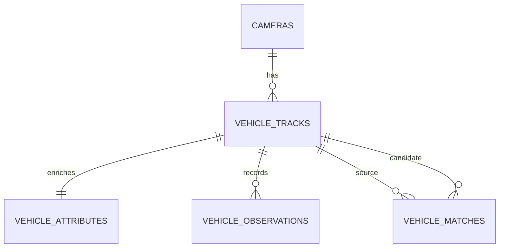

# Simple Database Schema

This proof-of-concept uses a small five-table schema so we can test multi-camera tracking data without bringing in production-level session, audit, or operations complexity.

## Tables

- `cameras`: configured test cameras and their input paths
- `vehicle_tracks`: one local track from one camera
- `vehicle_attributes`: best current plate and colour result for one track
- `vehicle_observations`: optional timestamped bounding boxes for debugging
- `vehicle_matches`: simple cross-camera comparison results

## Mermaid ER diagram

## How one track is stored

1. Insert a camera row in `cameras`
2. Insert one local track row in `vehicle_tracks`
3. Upsert the best colour and plate result into `vehicle_attributes`
4. Optionally insert multiple bounding-box rows into `vehicle_observations`
5. If a cross-camera candidate is found, insert one row into `vehicle_matches`

## Plate and colour storage

- `vehicle_colour` and `colour_confidence` store the current best colour estimate
- `plate_text` stores the best readable plate
- `plate_pattern` stores incomplete or wildcard-friendly forms like `DL01AB12?4`
- `plate_readings` keeps multiple OCR attempts as JSON for testing instead of using a separate table

## Matching logic

`vehicle_matches` is intentionally simple. It stores plate similarity, colour/class agreement flags, time gap, a final score, and a coarse status:

- `confirmed`
- `probable`
- `ambiguous`
- `rejected`

## Current limitations

- No stream sessions
- No VMS recordings
- No global vehicle identity table
- No decision history or rollback audit
- No job or error tables
- No person tracking

## Expansion path later

The schema can later grow into session-aware and audit-aware tables once the multi-camera basics are proven and the ingestion/tracking runtime is stable.
